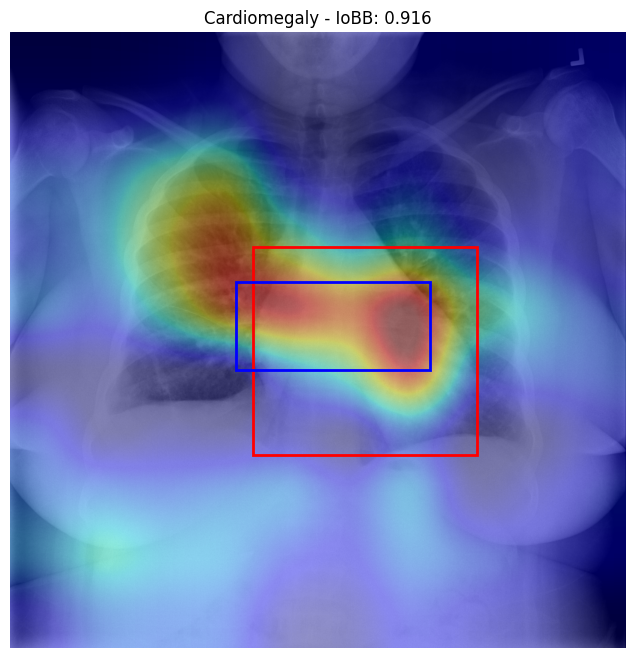
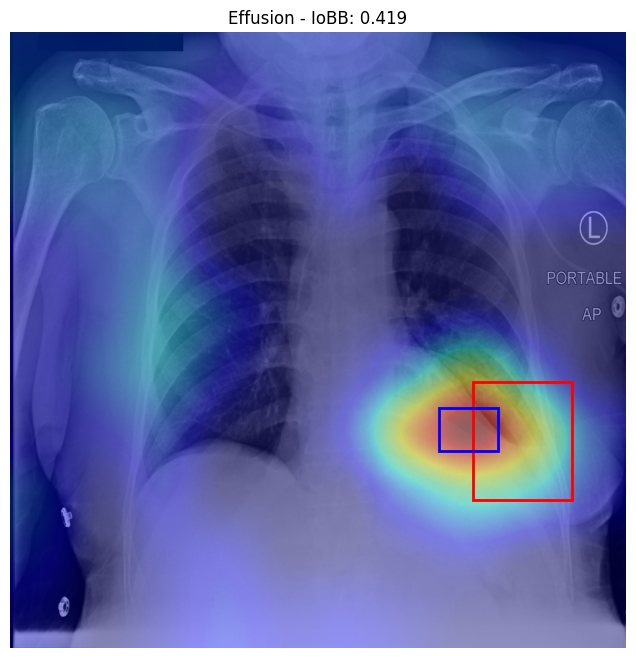
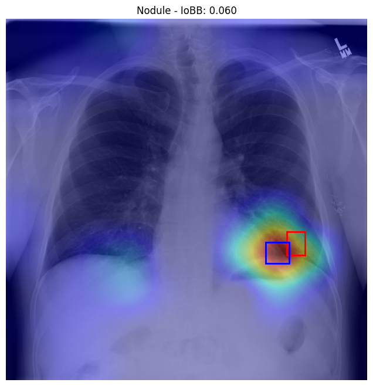

# Explainable Multi-Label Chest X-Ray Diagnosis

Multi-label classification of 14 thoracic pathologies from chest radiographs, with Grad-CAM explanations evaluated against radiologist-drawn bounding boxes.

Samsung Innovation Campus AI Capstone Project, Team Core (6 members).

> Research prototype. Not intended, validated, or suitable for clinical use.

---

## My contribution

I worked as the **XAI Specialist** for Team Core. In this repository, my contribution focuses on the Grad-CAM explainability and localization-evaluation pipeline:

- **Grad-CAM integration** with the final ConvNeXt-Tiny 320×320 BCE model
- **Target-layer selection** using `model.features[-1][-1].block[0]`
- **Class-specific heatmap generation** from raw class logits
- **Heatmap threshold tuning** on the dedicated `loc_tune` split
- **Frozen-threshold evaluation** on the held-out `loc_report` split
- **IoBB localization evaluation** against radiologist-drawn bounding boxes
- **Class-wise localization analysis** for the 8 pathologies with bounding-box annotations
- **Representative strong, moderate, and weak examples**
- **Reusable Grad-CAM / IoBB code** in `src/gradcam.py`
- **Technical documentation** in `docs/gradcam_iobb_summary.md`

My main notebook is:

`notebooks/convnext-gradcam-localization.ipynb`

Kaggle:

https://www.kaggle.com/code/layanabdullah11/convnext-gradcam-localization

The model-development notebooks, backend, frontend, and other team-level artifacts included in this repository are shared Team Core work and are kept here to show the project end-to-end.

---

## Problem

Chest X-ray classification can return model probabilities, but probabilities alone do not show which image regions influenced a prediction.

This project combines multi-label classification with Grad-CAM explainability so that a selected pathology prediction can be paired with a visual attention map.

My part of the project focused on evaluating whether those Grad-CAM regions actually overlapped radiologist-annotated pathology regions rather than relying only on visual inspection.

---

## Data

The project uses a working subset of the NIH ChestX-ray14 dataset containing **31,077 X-rays from 11,907 patients**.

The classification subset contains 25,895 images, while the full working set also includes the dedicated localization splits.

Splits are defined at the **patient level** to avoid patient leakage.

| Split | Images | Patients | Purpose |
|---|---:|---:|---|
| `train` | 18,013 | 7,930 | Model training |
| `val` | 3,978 | 1,699 | Hyperparameters and classification thresholds |
| `test` | 3,904 | 1,700 | Final classification evaluation |
| `loc_tune` | 2,606 | 289 | Grad-CAM threshold selection |
| `loc_report` | 2,576 | 289 | Final localization evaluation |

The model has **14 outputs**:

Atelectasis, Consolidation, Infiltration, Pneumothorax, Edema, Emphysema, Fibrosis, Effusion, Pneumonia, Pleural_Thickening, Cardiomegaly, Nodule, Mass, and Hernia.

`No Finding` is not a 15th model output. It is derived when no pathology probability crosses its class-specific threshold.

---

## Model

The team evaluated three CNN architectures on the same patient-level classification setup:

| Model | Input | Test Macro AUROC |
|---|---:|---:|
| ResNet50 | 224×224 | ~0.783 |
| DenseNet-121 | 224×224 | ~0.796 |
| **ConvNeXt-Tiny** | **320×320** | **0.8158** |

The final model is **ConvNeXt-Tiny** with:

| | |
|---|---|
| Input size | 320×320 |
| Outputs | 14 pathology logits |
| Loss | `BCEWithLogitsLoss` |
| Optimizer | AdamW |
| Decision thresholds | Tuned per class on validation |
| Early stopping | Used during training |
| Final Test Macro AUROC | **0.8158** |
| Macro F1 @ 0.50 | 0.3034 |
| Macro F1 @ tuned thresholds | **0.4236** |
| Macro ECE | **0.0258** |

The final ConvNeXt-Tiny checkpoint is not committed to GitHub because of file size.

---

## Classification results

The final ConvNeXt-Tiny model achieved:

| Metric | Value |
|---|---:|
| Test Macro AUROC | **0.8158** |
| Macro F1 @ 0.50 | 0.3034 |
| Macro F1 @ tuned thresholds | **0.4236** |
| Macro ECE | **0.0258** |

Threshold tuning improved macro F1 substantially compared with using a fixed 0.50 cutoff for every pathology.

The repository also contains team-level classification outputs and threshold files under `results/`.

---

## Explainability

Grad-CAM was applied to the final ConvNeXt-Tiny model to generate class-specific heatmaps.

The target layer used in my implementation is:

`model.features[-1][-1].block[0]`

The Grad-CAM procedure stores forward activations and backward gradients, computes gradient-based channel weights, applies ReLU, normalizes the CAM, and resizes the heatmap to the original image size.

### Threshold selection

A heatmap threshold sweep was performed on `loc_tune`.

The selected threshold was:

**T = 0.90**

It was selected on `loc_tune` only and then frozen before final evaluation on `loc_report`.

### Localization protocol

The localization evaluation covers the 8 pathologies with available bounding-box annotations:

- Atelectasis
- Cardiomegaly
- Effusion
- Infiltration
- Mass
- Nodule
- Pneumonia
- Pneumothorax

The classifier still predicts all 14 pathologies. The 8-class limitation applies only to quantitative localization evaluation.

In this implementation:

**IoBB = intersection area / predicted bounding-box area**

### Results on `loc_report`

Final evaluation included **373 image-class pairs**.

| Pathology | n | Mean IoBB | IoBB ≥ 0.50 |
|---|---:|---:|---:|
| Cardiomegaly | 81 | **0.886** | **88.9%** |
| Pneumonia | 53 | 0.441 | 41.5% |
| Effusion | 44 | 0.424 | 40.9% |
| Mass | 30 | 0.317 | 30.0% |
| Infiltration | 41 | 0.288 | 24.4% |
| Atelectasis | 57 | 0.257 | 22.8% |
| Pneumothorax | 33 | 0.106 | 9.1% |
| Nodule | 34 | 0.065 | 0.0% |

Overall:

| Metric | Value |
|---|---:|
| Mean IoBB | **0.417** |
| IoBB ≥ 0.10 | **56.6%** |
| IoBB ≥ 0.25 | **48.3%** |
| IoBB ≥ 0.50 | **39.4%** |

Representative examples:

| Example | IoBB |
|---|---:|
| Cardiomegaly — `00014706_007.png` | **0.916** |
| Effusion — `00028974_016.png` | **0.419** |
| Nodule — `00015141_002.png` | **0.060** |

<p align="center">
  
  
  
</p>

More details are available in:

`docs/gradcam_iobb_summary.md`

---

## Serving

The original Team Core project includes:

- a **FastAPI backend** under `backend/`
- an **HTML / CSS / JavaScript frontend** under `frontend/`
- prediction endpoints for the 14 pathology outputs
- Grad-CAM delivery through the backend

The frontend and backend are team artifacts included here to show the complete capstone workflow. My individual contribution remains the XAI / localization work described above.

Install dependencies:

```bash
pip install -r requirements.txt
```

Place the model checkpoint at:

```text
backend/model/convnext_tiny_320_best.pth
```

Start the backend:

```bash
cd backend
uvicorn main:app --reload
```

Serve the frontend:

```bash
cd frontend
python -m http.server 5500
```

Then open:

`http://127.0.0.1:5500/`

---

## Repository

```text
notebooks/
  01_data_preparation.ipynb             Patient-level splitting                     [team]
  02_densenet_baseline.ipynb            DenseNet-121 baseline                      [team]
  03_evaluation.ipynb                   DenseNet evaluation                        [team]
  04_resnet50_baseline.ipynb            ResNet50 baseline                          [team]
  05_resnet_evaluation.ipynb            ResNet50 evaluation                        [team]
  convnext-tiny-320-training.ipynb      Final ConvNeXt-Tiny model                  [team]
  convnext-gradcam-localization.ipynb   Grad-CAM + IoBB evaluation                 [my work]

docs/
  gradcam_iobb_summary.md               Localization protocol and results           [my work]

src/
  gradcam.py                            Reusable Grad-CAM + IoBB code               [my work]

backend/                                FastAPI backend                             [team]
frontend/                               HTML/CSS/JavaScript frontend                [team]
results/                                Classification and localization outputs
requirements.txt
README.md
```

---

## Team context

Team Core consisted of 6 members:

| Team member | Primary contribution |
|---|---|
| Rabeh Almutairi | Team leadership and final ConvNeXt-Tiny model development |
| Mohammed Almalki | Data engineering and patient-level dataset construction |
| Abdullah alsalhi | ResNet50 baseline and GitHub workflow/setup |
| **Layan Alazwari** | **Grad-CAM integration, target-layer selection, heatmap generation, and IoBB localization evaluation** |
| Deema Omar Alquwaei | FastAPI backend |
| Layan Allhidean | HTML/CSS/JavaScript frontend and API integration |

Original Team Core repository:

https://github.com/ABDULLHALSALHI/team-core-chest-xray

---

## Status

The main capstone pipeline is complete:

- patient-level data splitting
- DenseNet-121 baseline
- ResNet50 baseline
- final ConvNeXt-Tiny training and evaluation
- validation-tuned decision thresholds
- Grad-CAM explainability
- IoBB localization evaluation
- backend
- frontend

This personal repository is organized as a portfolio version of the full Team Core project while keeping my XAI contribution clearly separated from team work.

---

## Limitations

- This is a research and educational prototype, not a clinically validated diagnostic system.
- Classification and localization performance vary by pathology.
- Quantitative localization is limited to 8 pathologies with available bounding-box annotations.
- Grad-CAM indicates image regions that influenced a prediction; it does not confirm disease location.
- The Grad-CAM feature map is coarse relative to the original X-ray resolution.
- External-dataset validation and expert radiologist review would be required for clinical evaluation.
