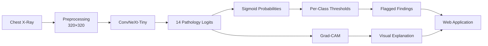

<div align="center">

# Explainable Multi-Label Chest X-Ray Diagnosis

**ConvNeXt-Tiny · Multi-Label Classification · Grad-CAM · IoBB Localization**

Samsung Innovation Campus AI Capstone Project — **Team Core**

An end-to-end research prototype for predicting 14 thoracic findings from chest X-rays and explaining selected predictions with class-specific Grad-CAM heatmaps.

[My XAI Notebook](notebooks/convnext-gradcam-localization.ipynb) · [Grad-CAM / IoBB Summary](docs/gradcam_iobb_summary.md) · [Original Team Repository](https://github.com/ABDULLHALSALHI/team-core-chest-xray) · [Kaggle Notebook](https://www.kaggle.com/code/layanabdullah11/convnext-gradcam-localization)

> **Research and educational prototype only. Not intended, validated, or suitable for clinical diagnosis.**

</div>

---

## My Contribution — Explainable AI & Localization

My role in Team Core was **XAI Specialist**. I was responsible for the Grad-CAM explainability and quantitative localization evaluation for the final ConvNeXt-Tiny model.

My work includes:

- Integrating Grad-CAM with the final **ConvNeXt-Tiny 320×320 BCE** model
- Selecting the target layer: `model.features[-1][-1].block[0]`
- Generating class-specific Grad-CAM heatmaps from raw class logits
- Converting thresholded heatmaps into predicted bounding boxes
- Tuning the heatmap threshold on the dedicated `loc_tune` split
- Freezing the selected threshold before final evaluation on `loc_report`
- Evaluating localization against radiologist-drawn bounding boxes using **IoBB**
- Reporting overall and class-wise localization performance across the 8 annotated pathologies
- Creating representative strong, moderate, and weak localization examples
- Refactoring the core Grad-CAM / IoBB logic into reusable code in `src/gradcam.py`

### Localization results

| Metric | Result |
|---|---:|
| `loc_tune` image-class pairs | 376 |
| Selected heatmap threshold | **0.90** |
| `loc_report` image-class pairs | **373** |
| Mean IoBB | **0.417** |
| IoBB ≥ 0.10 | **56.6%** |
| IoBB ≥ 0.25 | **48.3%** |
| IoBB ≥ 0.50 | **39.4%** |

In this implementation, **IoBB = intersection area / predicted bounding-box area**.

### Class-wise Grad-CAM localization

| Pathology | Pairs | Mean IoBB | IoBB ≥ 0.50 |
|---|---:|---:|---:|
| Cardiomegaly | 81 | **0.886** | **88.9%** |
| Pneumonia | 53 | 0.441 | 41.5% |
| Effusion | 44 | 0.424 | 40.9% |
| Mass | 30 | 0.317 | 30.0% |
| Infiltration | 41 | 0.288 | 24.4% |
| Atelectasis | 57 | 0.257 | 22.8% |
| Pneumothorax | 33 | 0.106 | 9.1% |
| Nodule | 34 | 0.065 | 0.0% |

### Representative localization examples

<p align="center">
  
  
  
</p>

<p align="center">
  <sub><b>Strong:</b> Cardiomegaly, IoBB 0.916 &nbsp; · &nbsp; <b>Moderate:</b> Effusion, IoBB 0.419 &nbsp; · &nbsp; <b>Weak:</b> Nodule, IoBB 0.060</sub>
</p>

---

## Project Overview

The system performs **multi-label classification**, meaning a single chest X-ray can receive probabilities for multiple findings at the same time.

The final model predicts these 14 pathologies:

`Atelectasis` · `Consolidation` · `Infiltration` · `Pneumothorax` · `Edema` · `Emphysema` · `Fibrosis` · `Effusion` · `Pneumonia` · `Pleural_Thickening` · `Cardiomegaly` · `Nodule` · `Mass` · `Hernia`

`No Finding` is **not** a 15th output. It is derived when no pathology probability exceeds its class-specific decision threshold.



---

## Dataset & Splits

The project uses a working subset of the **NIH ChestX-ray14** dataset containing **31,077 X-rays from 11,907 patients**.

Patient-level splitting was used to prevent the same patient from appearing across classification splits.

| Split | Images | Patients | Purpose |
|---|---:|---:|---|
| Train | 18,013 | 7,930 | Model training |
| Validation | 3,978 | 1,699 | Hyperparameters and classification thresholds |
| Test | 3,904 | 1,700 | Final classification evaluation |
| `loc_tune` | 2,606 | 289 | Grad-CAM threshold selection |
| `loc_report` | 2,576 | 289 | Final held-out localization evaluation |

The localization subsets are separate from the classification splits so that heatmap settings are not selected on the same data used for final localization reporting.

---

## Model Development

Three CNN architectures were evaluated on the same patient-level classification setup.

| Model | Input | Test Macro AUROC |
|---|---:|---:|
| ResNet50 | 224×224 | ~0.783 |
| DenseNet-121 | 224×224 | ~0.796 |
| **ConvNeXt-Tiny** | **320×320** | **0.8158** |

The final system uses **ConvNeXt-Tiny** with:

- 320×320 input resolution
- 14 output logits
- `BCEWithLogitsLoss`
- AdamW optimization
- Validation-tuned per-class decision thresholds
- Early stopping
- Final test Macro AUROC: **0.8158**
- Macro F1 at 0.5 cutoff: **0.3034**
- Threshold-tuned Macro F1: **0.4236**
- Macro ECE: **0.0258**

---

## Grad-CAM & IoBB Protocol

Grad-CAM explains a selected prediction by using the gradient of that class score with respect to the final ConvNeXt feature maps.

For this implementation:

1. A forward hook stores activations from `model.features[-1][-1].block[0]`.
2. A full backward hook stores class-specific gradients.
3. Spatially averaged gradients weight the activation maps.
4. ReLU keeps positive class evidence.
5. The CAM is min-max normalized.
6. The heatmap is resized to the original X-ray size.
7. A fixed threshold of **0.90** converts the heatmap into a predicted bounding box.
8. The predicted box is compared with the radiologist annotation using IoBB.

Quantitative localization was evaluated for the 8 pathologies in the NIH bounding-box subset:

**Atelectasis, Cardiomegaly, Effusion, Infiltration, Mass, Nodule, Pneumonia, and Pneumothorax.**

The classifier still predicts all 14 pathologies; the 8-class limitation applies only to localization evaluation.

Full methodology and results: **[docs/gradcam_iobb_summary.md](docs/gradcam_iobb_summary.md)**.

---

## End-to-End Application

This repository also includes the original Team Core application components so the full project can be viewed end-to-end:

- **Backend:** FastAPI model-serving code
- **Frontend:** HTML, CSS, and JavaScript web prototype
- **Prediction:** 14 pathology probabilities with per-class thresholds
- **Explainability:** class-specific Grad-CAM output

The radiologist bounding boxes are used **only for evaluation**. An application user only uploads a chest X-ray.

The model checkpoint itself is not committed to GitHub because of file size. The backend expects `convnext_tiny_320_best.pth` to be placed in `backend/model/` before local inference.

---

## Repository Structure

```text
explainable-multilabel-chest-xray/
├── backend/                         # Team Core FastAPI backend
├── frontend/                        # Team Core HTML/CSS/JS frontend
├── docs/
│   └── gradcam_iobb_summary.md      # My XAI/localization technical summary
├── notebooks/
│   ├── 01_data_preparation.ipynb
│   ├── 02_densenet_baseline.ipynb
│   ├── 03_evaluation.ipynb
│   ├── 04_resnet50_baseline.ipynb
│   ├── 05_resnet_evaluation.ipynb
│   ├── convnext-tiny-320-training.ipynb
│   └── convnext-gradcam-localization.ipynb  # My XAI/localization notebook
├── results/
│   ├── gradcam_iobb_config.json
│   ├── gradcam_iobb_results.csv
│   ├── gradcam_tune_sweep.csv
│   ├── gradcam_representative_examples.csv
│   └── gradcam_samples/
├── src/
│   └── gradcam.py                   # Reusable Grad-CAM + IoBB code from my work
├── requirements.txt
└── README.md
```

---

## Team Context & Attribution

This was a **6-member Team Core project**. This personal repository showcases the complete project while keeping individual contributions explicit.

| Team member | Primary project contribution |
|---|---|
| Rabeh Almutairi | Team leadership and final ConvNeXt-Tiny model development |
| Mohammed Almalki | Data engineering, subset construction, and patient-level splitting |
| Abdullah alsalhi | ResNet50 baseline and GitHub workflow/setup |
| **Layan Alazwari** | **Grad-CAM integration, target-layer selection, heatmap generation, and IoBB localization evaluation** |
| Deema Omar Alquwaei | FastAPI backend |
| Layan Allhidean | HTML/CSS/JavaScript frontend and API integration |

The shared model-development notebooks, frontend, backend, and team-level results are included here for end-to-end project context. My individual work is centered on the **XAI / Grad-CAM / localization pipeline**, its notebook, reusable source code, evaluation outputs, examples, and technical documentation.

For the collaborative source and team history, see the **[original Team Core repository](https://github.com/ABDULLHALSALHI/team-core-chest-xray)**.

---

## Key Project Files

| Resource | Location |
|---|---|
| My Grad-CAM / Localization Notebook | [notebooks/convnext-gradcam-localization.ipynb](notebooks/convnext-gradcam-localization.ipynb) |
| My Grad-CAM / IoBB Summary | [docs/gradcam_iobb_summary.md](docs/gradcam_iobb_summary.md) |
| Reusable Grad-CAM / IoBB Code | [src/gradcam.py](src/gradcam.py) |
| Final Localization Results | [results/gradcam_iobb_results.csv](results/gradcam_iobb_results.csv) |
| Threshold Sweep | [results/gradcam_tune_sweep.csv](results/gradcam_tune_sweep.csv) |
| Representative Samples | [results/gradcam_samples/](results/gradcam_samples/) |
| Kaggle XAI Notebook | [layanabdullah11/convnext-gradcam-localization](https://www.kaggle.com/code/layanabdullah11/convnext-gradcam-localization) |
| Original Team Repository | [Team Core Chest X-Ray](https://github.com/ABDULLHALSALHI/team-core-chest-xray) |
| NIH ChestX-ray14 Dataset | [NIH Chest X-Rays](https://www.kaggle.com/datasets/nih-chest-xrays/data) |

---

## Run the Backend Locally

Install dependencies:

```bash
pip install -r requirements.txt
```

Place the ConvNeXt checkpoint at:

```text
backend/model/convnext_tiny_320_best.pth
```

Then start the API:

```bash
cd backend
uvicorn main:app --reload
```

The frontend is configured to use the local API at `http://127.0.0.1:8000`.

To serve the frontend locally:

```bash
cd frontend
python -m http.server 5500
```

Then open `http://127.0.0.1:5500/`.

---

## Limitations

- This is a research and educational prototype, not a clinically validated diagnostic system.
- Classification and localization performance vary substantially across pathologies.
- Quantitative localization is limited to the 8 pathologies with NIH bounding-box annotations.
- Grad-CAM highlights image regions that influenced a model output; it does not establish the true clinical location of disease.
- The current localization metric depends on a thresholded rectangular extent of the CAM.
- External-dataset validation and expert radiologist review would be required before any clinical interpretation.

---

<div align="center">

### Samsung Innovation Campus AI Capstone — Team Core

**Deep Learning · Explainable AI · Medical Imaging · Grad-CAM · FastAPI**

</div>
